# P2 통합 설계서 — Multi-Channel Inbox + Validation Harness

Status: Draft **v0.2** (critique 합의 반영 + 사용자 채널 결정 반영, PRD 작성 입력 확정)
Last updated: 2026-05-17
Owner: 1인 운영자 (kimsanguine)
Scope: P2 multi-channel webhook + 자동 정합성 파이프라인 통합
Supersedes: v0.1 (Channel Talk 단일 우선 가설 → 이메일·카카오·오픈채팅 통합 가설로 갱신)
Reviewed-by: ai-backend-engineer (보안·인프라 CONDITIONAL), general-purpose (교육·PM CONDITIONAL)

v0.1 → v0.2 핵심 변경:
- 인입 채널 단일 가설(Channel Talk) → 4채널 통합(이메일·카카오 상담·카카오 오픈채팅·Channel Talk). 사용자 본인 운영자가 실제 사용 중인 채널 기준.
- production 런타임 명시: **Cloudflare Workers + Supabase** (habix.ai 기존 스택 재사용).
- override 사유 #3 ("리허설과 직교") **삭제** — 교육 critique C-1 수용. evidence_gate 미통과 사실을 정직하게 표기.
- 보안 critique 합의 권고 전면 반영: signature 검증, payload 크기 상한, /inbox GET 인증, OpenAI 호출과 webhook 응답 분리, Telegram 알림 포인터 룰.
- 교육 critique 합의 권고 전면 반영: 오프타임 정책, product_scope 필드, raw payload 30일 자동삭제(PIPA).

---

## 1. Background — 왜 P2 인가, hplan override 정직 명시

P1 (현재 완료) 상태: P1 카논(`docs/PRD.md`, `docs/SPEC.md`)과 동일. mock 50건 + 리허설 10건 + sample output 12 + Remotion mp4 + hplan 4종 + scripts/validate_schemas.py 15 check.

P2 진입의 트리거 (정직한 사유 2개, 허위 정당화 1개 삭제):

1. **운영자 자기 inbox 가 PMF Radar 의 첫 production 사용처**. 사용자가 실제 운영 중인 채널(이메일·카카오톡·카카오 오픈채팅방)에서 들어오는 messy customer voice 를 그대로 PMF evidence 로 흘리는 것.
2. **B2B 교육·세일즈 데모의 선행 작업**. habix.ai 영업 페이지에서 "라이브 인입 → PMF Radar" 데모 영상이 결제 트리거가 될 *가설*. 단 evidence 0건 → P2 자체가 가설 검증.
3. ~~30분 리허설과 직교한 트랙이므로 동시 진행 가능~~ → **삭제**. evidence_gate `CONDITIONAL_GO` 가 미닫힘이라는 사실을 가리는 표현이었음. P2 는 evidence_gate 를 *건너뛰지 않고*, 리허설과 *경합*함.

### product_gate_draft.md:91-93 override 사유 (정직본)

현 권고: *"실제 카카오톡/채널톡 연동은 보너스 설명으로만 둔다."*

P2 는 이를 **운영자 자기 사용 한정** 으로 부분 override 한다. 강의 자료(README, CLASSROOM_TRIAL_PACK, PARTICIPANT_HANDOUT) 에는 *P2 결과를 노출하지 않는다* — 강의는 mock 로만 가르치고, P2 는 운영자 개인 운영 도구이자 영업 데모. 두 트랙은 **메시지 격리** 가 기본값.

자동 답변은 **Tiered Auto-Reply 룰**(C15, signal_schema::auto_reply_trigger_rules) 외에는 금지. 룰 외 발송 차단은 절대 불변.

---

## 2. Problem Statement

> 1인 운영자가 현재 사용 중인 4채널(이메일·카카오톡 상담/채널·카카오 오픈채팅·Channel Talk) 인입을 PMF evidence 단일 파이프라인으로 통합한다. 답변은 항상 draft + human review. 운영자의 인지 부담을 24시간 노출시키지 않는다.

해결 단위:

- **수신**: 채널별 webhook 또는 manual import 로 안전하게 받는다 (signature 검증, replay 방지, payload 크기 상한, 인증된 inbox GET).
- **정규화**: P1 의 normalize_records 를 4채널 production payload 에 맞춰 확장.
- **마스킹**: P1 의 mask_pii 강화 (이름·회사명·주문번호 패턴, 정규식 처리). 분석 전 마스킹 + raw 30일 자동삭제.
- **분류**: 기존 `/api/classify` 그대로. webhook 응답 즉시 200 반환 + 분류 후처리 분리(Channel Talk 재전송 폭풍 방지).
- **운영자 알림**: HITL 항목 → Telegram **포인터 전용** (ID·카테고리·strength·대시보드 URL 만, 원문/마스킹 텍스트 본문 포함 X).
- **운영자 보호**: 오프타임(22:00–08:00) 알림 무음, batch 검토.
- **정합성 강제**: validate_schemas 25 check + 문서 lint matrix + Ralph verify 훅.

---

## 3. Constraints

| # | 제약 | 원천 | 영향 |
|---|------|------|------|
| C1 | 카카오톡 상담 webhook 은 파트너/딜러사 권한 필요 | KAKAO_INTEGRATION_SPEC.md §2 | P2.4 후순위 트랙 (Sinch 검토) |
| C2 | KakaoTalk Channel webhook 은 채널 add/block 만 (메시지 수신 X) | KAKAO_INTEGRATION_SPEC.md §2 | "kakao webhook" 명칭 분리 명시 필수 |
| C2b | **Channel Talk webhook = URL token** (`?token=<TOKEN>`), HMAC 아님 | B1 closed 2026-05-18, ε docs 조사 | URL token constant-time 검증, HMAC verify_signature 함수는 SNS 트랙 전용으로만 |
| C3 | **오픈채팅 자동 수집은 정책상 금지** | KAKAO_INTEGRATION_SPEC.md §2.5 | manual paste UI 로만 허용 |
| C4 | 공개 HTTPS callback 필요 | server.py:209 | Cloudflare Workers production, Tunnel/ngrok 은 dev only |
| C5 | **Tiered Auto-Reply 룰**(C15) 외 자동 발송 금지 | signal_schema + 사용자 결정 2026-05-18 | 룰 통과 외 모든 reply = draft + HITL |
| C6 | PII 분석 전 마스킹 + raw 30일 자동삭제 | PIPA + 교육 critique R-3 | mask_pii 강화, retention cron |
| C7 | idempotency 영속화 (재시작 후 dedup 유지) | server.py:WEBHOOK_IDS in-memory | Supabase 테이블 + 복합 키 `source:message_id` |
| C8 | **Telegram 알림 본문 포인터 전용** — PII/마스킹 텍스트 본문 포함 X | 보안 critique 충돌 3 + R-3 | scripts/notify_operator.py 템플릿 강제 |
| C9 | webhook payload 크기 상한 1 MB | 보안 critique 신규 위험 3 | do_POST 첫 줄에 `Content-Length` 가드 |
| C10 | `GET /api/webhooks/inbox` 인증 필수 | 보안 critique 신규 위험 2 | Bearer token (env `INBOX_READ_TOKEN`) |
| C11 | webhook 응답 200 즉시 반환, 분류 후처리 분리 | 보안 critique 신규 위험 1 | Workers `event.waitUntil()` 또는 Supabase queue |
| C12 | 오프타임(22:00–08:00 KST) 알림 무음, batch | 교육 critique R-1 | notify_operator.py 스케줄 가드 |
| C13 | 1인 운영자 — 운영 부담 최소 | 사용자 메모리 | Workers + Supabase 단일 인프라, 알림 1 채널 |
| C14 | 운영자 inbox 는 habix-course / pmf-radar-lab / other 로 product_scope 분리 | 교육 critique R-2 | normalize 시 product_scope 필드 부여 |
| C15 | **Tiered Auto-Reply 룰** — 5조건 AND, 이메일 채널만, 일일 ≤20건, 사전 승인 템플릿 only, LLM 생성 발송 금지 | signal_schema::auto_reply_trigger_rules + 사용자 결정 2026-05-18 | auto-reply 엔진은 *evaluate-only*, 답변 텍스트는 template DB 에서만 |
| C16 | 자동 발송 채널 화이트리스트: **이메일만** | 사용자 결정 2026-05-18 | 카카오·CT·오픈채팅은 항상 HITL. 확장은 1주 운영 데이터 후 |

---

## 4. Out of Scope (P2 에서는 X)

- **Tiered Auto-Reply 룰 외 자동 발송** (룰은 C15·signal_schema::auto_reply_trigger_rules)
- 90분 본편 강의 콘텐츠 변경 (강의는 mock 로만)
- **강의 자료(README/HANDOUT/TRIAL_PACK)에 P2 운영 결과 노출**
- B2B 익명화 데이터팩 (D-B2B 별도 트랙)
- 다국어/영어 응대
- **오픈채팅 자동 크롤링/스크래핑** (정책상 금지, manual paste 만)
- **raw payload 영속 저장** (masked 만 저장, raw 는 30일 자동삭제)
- pre-commit hook 강제 (Ralph verify 단일 게이트로 충분, α A5)
- Mermaid 다이어그램 자동 생성

---

## 5. Alternatives — 인입 채널 진입 경로 (옵션 A')

| 채널 | 진입 비용 | 운영 비용 | data quality | P2 우선순위 |
|------|----------|----------|--------------|--------------|
| **이메일 (AWS SES inbound, 이미 운영 중)** | Lowest (인프라 기존) | Low | High (운영자 실제 사용) | **P2.2 production 1순위** |
| **카카오 오픈채팅 (manual paste)** | Lowest (UI 만) | None | Medium (지연 + 운영자 수동) | **P2.1 fast follow** |
| **Channel Talk webhook** | Low | Low | Medium (운영자 미사용) | P2.2 차순위, 코드 유지 |
| **카카오톡 상담 (Sinch 또는 파트너)** | High | Medium | High | **P2.4 후순위** (가설 검증 후) |
| Open Chat 자동 크롤링 | — | — | — | 금지 (C3) |

선택: **옵션 A'** — 이메일 우선, 오픈채팅 manual paste 즉시, Channel Talk 코드 유지·운영 후순위, 카카오 상담 별도 트랙.

비교 → v0.1: Channel Talk 단일 우선이었으나 사용자 운영 채널과 불일치 → v0.2 에서 이메일 우선으로 갱신.

---

## 6. Phase Plan (유지 → 변경 → 신규, channel × work 매트릭스)

### Phase 1 — 유지 (P1 카논 보존)
- mock fixture / signal_schema / rehearsal / demo HTML / Remotion / `/api/classify` 인터페이스 / README·SPEC·DESIGN 본문 → **변경 없음**.

### Phase 2 — 변경 (기존 코드 surgical 확장)
- `server.py::normalize_webhook_payload` → 채널별(이메일·카카오·Channel Talk) payload 흡수 분기.
- `server.py::Handler.do_POST`:
  - 첫 줄: `Content-Length > 1MB` 가드 (C9, α 신규 3).
  - signature 검증 분기 추가 (Channel Talk: HMAC-SHA256, Email: provider 별, Kakao 상담: 추후) — α 충돌 1.
  - webhook 응답 200 즉시, 분류는 후처리 트리거 — C11.
- `server.py::do_GET /api/webhooks/inbox` → `Authorization: Bearer ${INBOX_READ_TOKEN}` 강제 (C10, α 신규 2).
- `server.py::mask_pii` → 이름·회사명·주문번호 정규식 추가 (Rule 5, 모델 사용 X).
- `data/channel_adapter_schema.json` → `required_adapter_fields` 에 `signature_verified: boolean`, `product_scope: string` 추가 (C14).

### Phase 3 — 신규
- **인입 채널**
  - 이메일 수신 Worker (`workers/email-inbound/`): **AWS SES inbound rule → SNS HTTPS subscription → Cloudflare Worker fetch**. SNS Message Signature(X-Amz-SNS-Signature) 검증 필수. SES rule 은 ap-northeast-1 Tokyo 리전 (habix.ai MX 이미 설정됨).
  - 오픈채팅 manual paste UI 컴포넌트 (`demo/index.html` 안에 paste textarea + `source: kakao_openchat_manual`).
  - Channel Talk Workers receiver (production 1차 deploy).
  - 카카오톡 상담 — Sinch 또는 파트너 권한 트랙 (`scripts/eval_kakao_consultalk.md` 검토 문서만).
- **스키마/검증**
  - `data/webhook_payload_schema.json` 신설 (4채널 production payload 명세).
  - `scripts/validate_schemas.py` 25 check 로 확장 (§10).
- **인프라**
  - `wrangler.toml` 신설 — Cloudflare Workers + Supabase Service Binding.
  - Supabase 테이블: `webhook_inbox`, `webhook_idempotency`, `raw_payload_retention`(30일 삭제 cron).
  - Supabase row 가 `product_scope` enum (`habix_course | pmf_radar_lab | other`).
- **운영자 자동화**
  - `scripts/notify_operator.py` — Telegram 포인터 전용 알림 (C8 템플릿 강제, 오프타임 가드 C12).
  - `scripts/retention_cleanup.py` — raw payload 30일 자동삭제 cron (Workers cron trigger).
  - `hplan/ralph_verify_report.md` 자동 inclusion (validate_schemas 결과).
- **Tiered Auto-Reply (이메일 채널만, C15·C16)**
  - `workers/auto-reply/` Worker — 5조건 평가 + dwell queue + Telegram 취소 버튼.
  - `data/auto_reply_templates.json` 신설 — category × locale 키, last_reviewed_at 필드 포함.
  - Supabase `auto_reply_log` 테이블 — 7일 보존, audit.
  - 일일 cap 20건 — Supabase row count 기반.

### Phase 4 — 후속 (별도 PRD)
- 카카오톡 상담 파트너 권한 확보 또는 Sinch 통합.
- B2B 영업 페이지 라이브 데모 영상 (D-B2B 트랙으로 분기).
- evidence_gate 5명 인터뷰 완료 후 90분 본편 승격 vs 보류 결정.

---

## 7. System Workflow (mermaid)

```mermaid
flowchart TD
  subgraph Inbound["Phase 3 인입 (4채널)"]
    EM["Email (AWS SES inbound → SNS HTTPS, Tokyo)"]
    KO["Kakao Open Chat (manual paste UI)"]
    CT["Channel Talk webhook"]
    KK["Kakao 상담 (P2.4 후순위, Sinch)"]
  end
  EM -->|X-Amz-SNS-Signature RSA-SHA1| W
  CT -->|URL ?token=&lt;CHANNEL_TALK_WEBHOOK_TOKEN&gt; (B1 closed 2026-05-18)| W
  KK -.->|파트너 권한 후| W
  KO -->|operator paste| W
  W["Cloudflare Worker /api/webhooks/*"] --> S1["payload size guard (≤1MB)"]
  S1 --> S2["signature 검증"]
  S2 -->|invalid| X["401"]
  S2 -->|valid| S3["Supabase idempotency 조회 (source:message_id)"]
  S3 -->|dup| Z["200 (dedup)"]
  S3 -->|new| R["200 즉시 반환 + event.waitUntil()"]
  R --> N["normalize + mask_pii + product_scope 부여"]
  N --> CL["/api/classify (OpenAI Responses)"]
  CL --> SB["Supabase webhook_inbox 저장 (masked only)"]
  CL --> H{"HITL 필요?"}
  H -->|Yes + on-hours| NT["scripts/notify_operator.py → Telegram (포인터)"]
  H -->|Yes + off-hours| BQ["batch queue (다음 on-hour 일괄)"]
  H -->|No| BL["hplan Backlog (Supabase)"]
  NT --> OP["운영자 대시보드 (Bearer auth)"]
  BQ --> OP
  BL --> OP
  OP --> M["운영자 수동 draft reply 전송"]

  subgraph Validation["Phase 3 검증 하네스"]
    V1["validate_schemas.py 25 check"]
    V2["문서 lint matrix"]
    V3["asset 무결성"]
    V1 -.->|on Ralph verify| V4["ralph_verify_report.md auto-section"]
    V2 -.-> V4
    V3 -.-> V4
  end

  subgraph Retention["Phase 3 보존 정책 (PIPA)"]
    RP["raw_payload_retention"] -->|cron every 24h| RD["raw > 30d 삭제"]
  end
```

핵심 결정:
- webhook 200 즉시 반환 + 분류 후처리 분리 (C11) — 동기 처리 X.
- HITL 알림은 on-hours/off-hours 분기. off-hours batch.
- Supabase 가 webhook_inbox, idempotency, retention 모두 통합 저장. Workers 는 stateless.

---

## 8. User Flow (mermaid)

```mermaid
flowchart TD
  subgraph P1["페르소나 1 — 1인 운영자 (사용자 본인)"]
    O1["고객 메시지가 이메일/카카오/오픈채팅으로 들어옴"] --> O2{"on-hours?"}
    O2 -->|Yes| O3["Telegram 포인터 알림 (ID·카테고리·strength·URL)"]
    O2 -->|No| O4["batch — 다음 on-hour 까지 무음"]
    O3 --> O5["대시보드 (Bearer auth) 접속"]
    O4 --> O5
    O5 --> O6["분류 결과 확인 + 약한 evidence 무시"]
    O6 --> O7["강한 evidence: draft reply 검토 → 수동 전송"]
    O7 --> O8["product_scope=habix_course 면 PMF Lab 분석 제외"]
  end
  subgraph P2["페르소나 2 — 수강생 (P1 유지)"]
    S1["mock inbox 50 fixture"] --> S2["prompts/01 실행"]
    S2 --> S3["PMF Radar 시각화"]
    S3 --> S4["hplan Gate 토론"]
    S4 -.강의 자료에 P2 운영 결과 노출 X.-> S5["mock 만 토론"]
  end
  subgraph P3["페르소나 3 — B2B PM (D-B2B 트랙 입력, 본 PRD 후속)"]
    BP1["habix.ai 영업 페이지 라이브 데모 시청"] --> BP2["현업 흥미 → HRD 결제 결정 분리"]
    BP2 -.evidence 0건 가설.-> BP3["인터뷰 3건 후 D-B2B PRD"]
  end
```



페르소나별 차이:
- **운영자**: 비동기 push(on/off-hours) → 대시보드 → 수동 액션. product_scope 로 강의/Lab/기타 분리.
- **수강생**: 동기 pull(수업 시간 안). mock 만. P2 운영 결과는 *강의에 노출되지 않음*.
- **B2B PM**: 영업 콘텐츠 → 현업 PM 흥미 + HRD 결제 분리. 가설 검증 후 D-B2B PRD.

---

## 9. Diagram Consistency Matrix

| 요구사항 | System §7 | User §8 | 매핑 |
|---------|-----------|---------|------|
| 4채널 인입 | EM/KO/CT/KK | O1 | ✓ |
| 오픈채팅 manual paste 한정 | KO label | O1 (operator paste 흐름) | ✓ |
| signature 검증 | S2 | (배경 자동) | ✓ |
| payload 1MB 가드 | S1 | (배경 자동) | ✓ |
| idempotency 영속 | S3 | (배경 자동) | ✓ |
| 200 즉시 + 후처리 | R | (배경 자동) | ✓ |
| PII 마스킹 | N | (배경 자동) | ✓ |
| product_scope 분리 | N | O8 | ✓ |
| on/off-hours 분기 | H 라벨 | O2→O3/O4 | ✓ |
| Telegram 포인터 | NT | O3 | ✓ |
| Bearer auth inbox | (배경) | O5 라벨 | ✓ |
| raw 30일 삭제 | Retention RP/RD | (배경 자동) | ✓ |
| 강의 자료 격리 | (없음 — 별 경로) | S4→S5 | ✓ (명시적 분리) |
| B2B 트랙 | (없음) | BP1→BP3 | ⚠ Phase 4 후속 |
| Validation Harness | V1→V4 | (배경) | ✓ |

**결정**: B2B 트랙은 본 PRD 입력으로만 표시 — Phase 4 별도 PRD.

---

## 10. Integrated Validation Scope (자동 정합성 파이프라인)

P1 의 15 check → P2 의 25 check 확장:

| # | 분류 | 체크 | Phase |
|---|------|------|-------|
| 16 | 스키마 | webhook_payload_schema ↔ Channel Talk fixture | 3 |
| 17 | 스키마 | webhook_payload_schema ↔ Email fixture | 3 |
| 18 | 스키마 | webhook_payload_schema ↔ Kakao expected fixture | 3 |
| 19 | 스키마 | normalize_webhook_payload 출력 ↔ normalized_inquiry_fields | 3 |
| 20 | 스키마 | product_scope ∈ {habix_course, pmf_radar_lab, other} | 3 |
| 21 | 문서 lint | README 카운트(문의 50, 리허설 10, 90분 6단계) grep | 3 |
| 22 | 문서 lint | "예정/TODO/미완" stale 표현 flag | 3 |
| 23 | 문서 lint | DESIGN.md / SPEC.md / P2_DESIGN.md cross-reference | 3 |
| 24 | asset | demo/assets, remotion output path 무결성 | 3 |
| 25 | 정책 | raw_payload_retention 의 모든 row 가 30일 이하 (PIPA) | 3 |
| 26 | 정책 | auto_reply_log 의 모든 row 가 approved_template_id 보유 (LLM 생성 발송 0건 검증) | 3 |
| 27 | 정책 | auto_reply_log 일일 count ≤ 20 (cap 검증) | 3 |
| 28 | 정책 | auto_reply_templates.json 의 모든 entry 가 last_reviewed_at ≤ 30일 (stale flag) | 3 |

추가 (선택, Phase 4):
- webhook 응답 latency 1초 이내 (200 즉시 반환 SLO).
- Telegram 알림 본문에 PII 패턴 grep 0건 (C8 강제).

트리거: **Ralph verify 훅 편입**. fail 시 hard block. `scripts/validate_schemas.py --report` 가 `hplan/ralph_verify_report.md` 의 validation 섹션 자동 생성.

`.git/hooks/pre-commit` 은 Out of Scope (C13 단순성).

---

## 11. Gate Criteria & Next

### Phase 2 통과 조건 (변경)
- [ ] 기존 15 check PASS 유지
- [ ] payload size guard unit test
- [ ] signature 검증 unit test (HMAC-SHA256 with `hmac.compare_digest`)
- [ ] mask_pii 신규 패턴 unit test
- [ ] `/api/webhooks/inbox` Bearer auth 401 테스트
- [ ] webhook 200 latency < 1초 (분류 후처리 분리 확인)

### Phase 3 통과 조건 (신규)
- [ ] webhook_payload_schema.json + 25 check PASS
- [ ] Cloudflare Workers production deploy — Email 1건 round-trip 성공
- [ ] Supabase idempotency — 재시작 후 dedup 유지 검증
- [ ] Telegram 알림 1회 round-trip + 본문 PII grep 0건
- [ ] raw_payload_retention cron 동작 (테스트 row 30일 이전/이후 삭제 확인)
- [ ] ralph_verify_report.md validation 섹션 자동 생성
- [ ] **운영자가 24시간 무중단 1주 운영** (volume 가설 검증)

### Phase 3 통과 *후* gate
- evidence_gate 5명 인터뷰 (B2B PM 3 + 강의 수강생 2) 진행 — 별도 트랙.
- 리허설 1회 실행 — 별도 트랙. *P2 가 리허설을 대체하지 않음*.

### PRD 분해 단위 (docs/PRD-P2.md 작성 시)
1. **P2.1 — receiver hardening** (Phase 2 전체)
2. **P2.2 — Email production deploy** (Phase 3 인입 + 인프라 + 알림)
3. **P2.3 — validation harness 25 check + Ralph 훅** (Phase 3 검증)
4. **P2.4 — 카카오톡 상담 검토 트랙** (Phase 4 별도 PRD)

---

## Appendix A — 사용자 결정 + critique 권고 적용 결과

| 항목 | v0.1 | v0.2 | 출처 |
|------|------|------|------|
| 인입 채널 | Channel Talk 단일 | 이메일·카카오·오픈채팅·CT 통합 | 사용자 U1 |
| production 런타임 | "Tunnel 또는 production HTTPS" | **Workers + Supabase** | 사용자 U3 + α A2/A3 |
| override 사유 #3 | 포함 | **삭제** | β C-1 |
| signature 검증 | A1 (질문) | C 제약 + Phase 2 첫 작업 | α 충돌 1 |
| payload 크기 상한 | 없음 | C9 + Phase 2 | α 신규 3 |
| /inbox GET 인증 | 없음 | C10 + Phase 2 | α 신규 2 |
| 200 즉시 + 후처리 | 동기 처리 | C11 + Phase 2 | α 신규 1 |
| Telegram 포인터 룰 | 미정 | C8 강제 + 템플릿 | α 충돌 3 |
| 오프타임 알림 | 없음 | C12 + Phase 3 notify_operator | β R-1 |
| product_scope 필드 | 없음 | C14 + Phase 2 + 검증 #20 | β R-2 |
| raw 30일 자동삭제 | 없음 | C6/§4 + Phase 3 retention cron + 검증 #25 | β R-3 (PIPA) |
| 오픈채팅 자동수집 | 미명시 | **금지 (C3)**, manual paste 만 | KAKAO_SPEC §2.5 |
| 강의 자료 격리 | 미명시 | §4 + §8 명시적 분리 | β C-4 |

## Appendix B — 미해결 결정 (PRD 작성 단계로 위임)

- B1. Channel Talk `x-channel-signature` 헤더명·timestamp 포함 여부 — 공식 docs 최종 확인 (α A1).
- ~~B2. 이메일 인입 경로~~ → **확정: AWS SES inbound (ap-northeast-1)**. DNS MX 조회로 ground truth 확인 (2026-05-18). habix.ai 도메인의 MX = `10 inbound-smtp.ap-northeast-1.amazonaws.com`, SPF = `include:amazonses.com`. P2.2 sprint 0 에서 SES inbound rule + SNS topic 만 신설하면 됨.
- B3. Supabase 테이블 스키마 상세 — PRD P2.2 에서 확정.
- B4. Telegram 봇 + 운영자 chat_id 등록 절차 — PRD P2.2 의 setup 섹션.
- B5. 일일 webhook 볼륨 추정 — 운영 1주 후 실측, Phase 3 통과 조건 7번이 이걸 검증.
