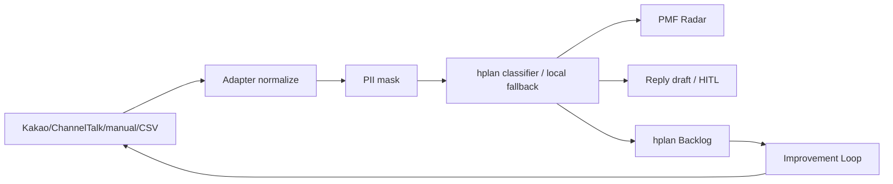

# SPEC: CS Inbox to PMF Radar Lab

Status: P1 hplan Workflow Ready / Scope Checked + P2.1 sprint 0 completed (server.py hardening + 12 unit test PASS, see `docs/PRD-P2.md`)  
Last updated: 2026-05-18

## 1. System Overview

이 패키지는 강의용 실습 자료이자 local API-backed P1 prototype이다. `server.py`가 정적 demo와 `/api/classify`를 같은 origin에서 제공하고, 브라우저는 mock/manual/CSV/JSON/webhook inbox 문의를 hplan evidence workflow로 다시 그린다.

외부 메시징 플랫폼 live 연결은 아직 완료 상태가 아니다. Channel Talk/Kakao는 receiver stub, fixture, integration readiness endpoint까지 구현했고, 실제 live 연결에는 계정 권한, 공개 HTTPS callback, token/signature 검증이 필요하다.



## 2. File Structure

```text
cs-inbox-pmf-radar-lab/
  README.md
  data/
    sample_inquiries.json
    rehearsal_inquiries_10.json
    signal_schema.json
  demo/
    index.html
    landing-v1-editorial.html
    landing-v2-kakao-ops.html
    assets/hplan-pmf-demo.mp4
    assets/hplan-pmf-demo-poster.png
  remotion/
    src/HplanPmfDemo.tsx
  server.py
  docs/
    CLASSROOM_TRIAL_PACK.md
    PARTICIPANT_HANDOUT.md
    PRD.md
    SPEC.md
    PROGRESS.md
    REHEARSAL_PLAN.md
  outputs/
    signal_extraction_sample.json
    rehearsal_signal_extraction_10.json
    rehearsal_answer_key.md
    improvement_report_sample.md
  hplan/
    evidence_gate_template.md
    evidence_report.generated.json
    evidence_input.json
    facilitator_guide.md
    opportunity_solution_tree.md
    product_gate_draft.md
    rehearsal_checkpoint.md
    rehearsal_results_template.md
    ralph_loop_run.md
  harness/
    decisions.jsonl
  tasks/
    prd-cs-inbox-pmf-radar-lab.md
    prd.json
    ralph_task_board.md
  prompts/
    01_signal_extraction.md
    02_improvement_loop.md
```

## 3. Data Spec

### 3.1 Raw Inquiry

Source: `data/sample_inquiries.json`

```json
{
  "id": "inq-001",
  "channel": "mock_kakao",
  "segment": "Claude Code 첫 설치 수강생",
  "message": "맥에서 설치하다가 zsh: command not found가 떠서 40분째 멈춰있어요.",
  "label_hint": "setup"
}
```

Required fields:

- `id`: unique inquiry id
- `channel`: mock source channel
- `segment`: situation-based customer segment
- `message`: original customer message
- `label_hint`: rough seed category for teaching

### 3.2 Rehearsal Inquiry Subset

Source: `data/rehearsal_inquiries_10.json`

Purpose:

- 30분 압축 리허설에서 사용한다.
- 전체 50개를 다루기 전, strong/medium/weak evidence 구분과 hplan decision의 이해 여부를 검증한다.
- 각 문의에는 `teaching_role`을 포함해 강사가 왜 이 문의를 골랐는지 알 수 있게 한다.

### 3.3 PMF Signal Record

Target schema: `data/signal_schema.json`

Core fields:

- `category`
- `emotion`
- `pain`
- `push`
- `pull`
- `habit`
- `anxiety`
- `workaround`
- `buying_or_retention_trigger`
- `evidence_strength`
- `evidence_reason`
- `suggested_action`
- `hplan_gate`
- `priority`

Evidence strength rules:

- `strong`: 최근 실제 막힘, 반복 워크어라운드, 시간/돈 손실, 이탈/환불/구매 트리거가 명시됨
- `medium`: 불편은 분명하지만 빈도, 최근성, 경제적 영향, 대체 행동이 일부만 있음
- `weak`: 칭찬, 막연한 희망, 단순 기능 요청, 구체적 사건 없는 의견

## 4. Prompt Spec

### 4.1 Signal Extraction Prompt

File: `prompts/01_signal_extraction.md`

Input:

- `data/sample_inquiries.json`
- `data/signal_schema.json`

Output:

```json
{
  "records": [],
  "clusters": [],
  "top_insights": [],
  "what_not_to_build": [],
  "hplan_recommendation": {
    "decision": "interview | conditional_go | build | pivot | hold",
    "reason": "",
    "next_checkpoint": ""
  }
}
```

### 4.2 Improvement Loop Prompt

File: `prompts/02_improvement_loop.md`

Output sections:

- Executive Summary
- Evidence Table
- What Not To Build
- Opportunity Solution Tree
- Course Improvement Backlog
- FAQ Draft
- Interview Kit
- Next Human Checkpoint

## 5. Demo UI Spec

File: `demo/index.html`

Type: static HTML/CSS/JS served by `server.py`; no frontend build step required.

Primary regions:

- Habix-style top navigation
- Dark hero: product promise and hplan decision
- Core feature row: INPUT, MASK, ROUTE, PLAN
- Remotion hero video: 문의가 들어와 hplan loop로 개선 후보가 되는 장면
- 6-step workflow rail: input → normalize → mask → classify → reply/HITL → backlog
- `02 hplan 신호 분석` diagram: 문의 원문 → PII 마스킹 → hplan evidence → Intent/Anxiety/Workaround/Trigger → 답변/HITL/Backlog
- Source panel: Kakao Channel, Channel Talk, Open Chat, Manual CSV
- Evidence Map: frequency × risk bubble map
- Signal Inspector: selected quote, Push, Anxiety, Decision, What Not Now
- Action queue: build/interview/guardrail cards
- Flow section: input → classify → route → backlog loop

Compatibility URLs:

- `demo/landing-v1-editorial.html` redirects to `demo/index.html`
- `demo/landing-v2-kakao-ops.html` redirects to `demo/index.html`
- Public demo paths must not expose V1/V2/Default variant navigation.

Design intent:

- habix.ai 서브도메인에 어울리는 한국형 강의/컨설팅 랜딩 톤
- warm paper background, dark hero, terracotta CTA, Noto Sans KR + JetBrains Mono
- "예쁜 대시보드"보다 "문의가 제품 개선 신호로 변환되는 장면"에 집중
- 카드 radius 8px 이하, V1/V2 실험안 노출 금지, canonical landing 단일화

## 6. Local API Spec

File: `server.py`

Endpoints:

- `GET /api/health`: local classifier readiness
- `GET /api/integration-status`: OpenAI/Channel Talk/Kakao live setup state and missing items
- `POST /api/classify`: server-side OpenAI Responses API call with Structured Outputs
- `POST /api/webhooks/channel-talk`: receiver. **P2.1: HMAC-SHA256 x-channel-signature 검증** (env `CHANNEL_TALK_WEBHOOK_SECRET` 설정 시), payload size 1MB > 413
- `POST /api/webhooks/kakao`: receiver stub (Phase 4 — Sinch 또는 파트너 권한 검토 트랙)
- `GET /api/webhooks/inbox`: last accepted records. **P2.1: Bearer auth** (env `INBOX_READ_TOKEN` 설정 시 `Authorization: Bearer <token>` 필수)

Runtime guardrails:

- API key stays server-side. Webhook secret/token never logged (`.env` 또는 Workers env only).
- **Webhook payload size guard**: `Content-Length > 1MB` → 413 즉시 반환, body 읽지 않음.
- **Channel Talk signature 검증**: `verify_signature(secret, raw_body, header_sig)` HMAC-SHA256 + `hmac.compare_digest` (timing attack 방지). secret 미설정 = dev mode skip, production env 에선 반드시 설정.
- **`mask_pii` 강화 (P2.1)**: 이메일·전화번호·카드/계좌 패턴(P1) + **이름(한글 2-4자 + 직책 조사 lookahead)·회사명(주식회사·㈜·Inc/Co/Ltd/Corp)·주문번호(영문+숫자 8자리)** 추가. 정규식만, LLM 사용 X (Rule 5).
- UI labels expose "hplan 분석 엔진" instead of concrete model names.
- Webhook receiver preserves raw `source`, normalizes `channel`, and ignores duplicate event/message ids.
- Reply output is draft-only by default. **Tiered Auto-Reply** (이메일·사전 승인 템플릿·5조건 AND, see `data/signal_schema.json::auto_reply_trigger_rules`) 통과 시에만 자동 발송 허용.

## 7. hplan Spec

### 7.1 Evidence Gate

File: `hplan/evidence_gate_template.md`

Required outputs:

- Market Diagnosis
- Raw Evidence Sources
- Evidence Rubric
- Strong Signal Candidates
- Weak Signal Candidates
- What Not To Build
- Human Evidence Checkpoint

### 7.2 Product Gate

File: `hplan/product_gate_draft.md`

Required outputs:

- Problem Brief
- Primary ICP
- Push/Pull/Habit/Anxiety
- Buying Trigger
- User Journey Map
- Sitemap
- Design Guidelines
- Productive Outcome
- Proceed/Pivot/Hold Criteria

### 7.3 Opportunity Solution Tree

File: `hplan/opportunity_solution_tree.md`

Required structure:

- 1 measurable outcome
- 2+ opportunities
- each opportunity has at least one solution
- each solution has exactly one experiment and decision rule
- weak or unproven opportunities go to Parking Lot

## 7. Acceptance Criteria

Functional:

- [x] `sample_inquiries.json` contains exactly 50 inquiries.
- [x] `signal_schema.json` is valid JSON.
- [x] `evidence_input.json` is valid JSON.
- [x] `demo/index.html` opens as a static file without a server.
- [x] Demo has selectable messages and clusters.
- [x] Legacy demo variant URLs redirect to canonical `demo/index.html`.
- [x] Public GNB has no V1/V2 variant labels.
- [x] `DESIGN.md` lint passes with 0 errors and 0 warnings.
- [x] hplan materials include Evidence Gate, Product Gate, OST, facilitator guide.
- [x] Sample signal extraction output exists.
- [x] Rehearsal signal extraction output exists.
- [x] Sample improvement report exists.
- [x] Participant handout exists.
- [x] Instructor answer key exists.
- [x] Ralph PRD and task board exist.

Teaching:

- [x] The package distinguishes chatbot automation from PMF evidence analysis.
- [x] The package includes "What Not To Build".
- [x] The package shows strong/medium/weak evidence.
- [x] The package includes a 90-minute run of show.
- [ ] Claude Code live execution transcript is captured.
- [ ] A real rehearsal with 1-2 learners is completed.

## 8. Output Spec

### 8.1 Signal Extraction Sample

File: `outputs/signal_extraction_sample.json`

Purpose:

- Claude Code live 실행이 흔들릴 때 사용할 fallback output
- 수강생이 기대 출력 형식을 볼 수 있는 reference

Required sections:

- `metadata`
- `records`
- `clusters`
- `top_insights`
- `what_not_to_build`
- `hplan_recommendation`

### 8.2 Rehearsal Signal Extraction Sample

File: `outputs/rehearsal_signal_extraction_10.json`

Purpose:

- 30분 리허설용 기대 출력
- live Claude Code 실행 시간이 부족할 때 사용할 fallback
- strong/medium/weak evidence 구분을 빠르게 검토하는 reference

Required sections:

- `metadata`
- `records`
- `clusters`
- `what_not_to_build`
- `human_checkpoint`

### 8.3 Improvement Report Sample

File: `outputs/improvement_report_sample.md`

Purpose:

- Signal extraction이 실제 강의 개선안으로 이어지는 모습을 보여준다.
- hplan Evidence/Product Gate가 단순 분류 이후 어떤 판단을 만드는지 설명한다.

Required sections:

- Executive Summary
- Evidence Table
- What Not To Build
- Opportunity Solution Tree
- Course Improvement Backlog
- FAQ Draft
- Interview Kit
- Next Human Checkpoint

## 9. Verification Commands

Run from repository root:

```bash
python3 -m json.tool cs-inbox-pmf-radar-lab/data/sample_inquiries.json
python3 -m json.tool cs-inbox-pmf-radar-lab/data/rehearsal_inquiries_10.json
python3 -m json.tool cs-inbox-pmf-radar-lab/data/signal_schema.json
python3 -m json.tool cs-inbox-pmf-radar-lab/data/rehearsal_signal_schema.json
python3 -m json.tool cs-inbox-pmf-radar-lab/hplan/evidence_input.json
python3 -m json.tool cs-inbox-pmf-radar-lab/outputs/signal_extraction_sample.json
python3 -m json.tool cs-inbox-pmf-radar-lab/outputs/rehearsal_signal_extraction_10.json
python3 -m json.tool cs-inbox-pmf-radar-lab/hplan/evidence_report.generated.json
python3 -m json.tool cs-inbox-pmf-radar-lab/tasks/prd.json
python3 -c "from html.parser import HTMLParser; HTMLParser().feed(open('cs-inbox-pmf-radar-lab/demo/index.html').read()); print('html parsed')"
# P2.1 sprint 0 추가 검증 (2026-05-18)
cd cs-inbox-pmf-radar-lab && python3 scripts/validate_schemas.py          # 15 check
cd cs-inbox-pmf-radar-lab && python3 -m unittest tests.test_server -v     # 12 unit test
# P1 hplan 도구
python3 ../260514_hplan/hplan/scripts/generate_report.py cs-inbox-pmf-radar-lab/hplan/evidence_input.json --json
python3 ../260514_hplan/hplan/scripts/decision_log.py audit --root cs-inbox-pmf-radar-lab
```

Known verification result:

- sample inquiry count: 50
- JSON validation: pass
- HTML parse: pass
- hplan helper score: 77
- hplan helper decision: `build`
- instructor interpretation: `CONDITIONAL_GO` because evidence is mock/teaching data

## 10. Risks

- 수강생이 실습을 "상담봇 만들기"로 오해할 수 있다.
- 실제 카카오톡 연동 질문으로 범위가 커질 수 있다.
- mock 데이터가 너무 잘 짜여 있으면 실제 messy customer voice 느낌이 약해질 수 있다.
- 시각화가 강하면 hplan 사고보다 대시보드 디자인에 관심이 쏠릴 수 있다.

## 11. Next Implementation Options

Option A: Keep as static teaching kit

- 현재 형태 유지
- 강의자료와 리허설에 집중

Option B: Add generated output sample

- Claude Code 실행 결과 JSON과 Markdown 리포트 예시 추가
- 수강생이 정답 예시와 비교 가능

Option C: Build small local app

- JSON upload
- live cluster filtering
- generated report preview

Recommended next: run the first classroom trial using `docs/CLASSROOM_TRIAL_PACK.md`.
